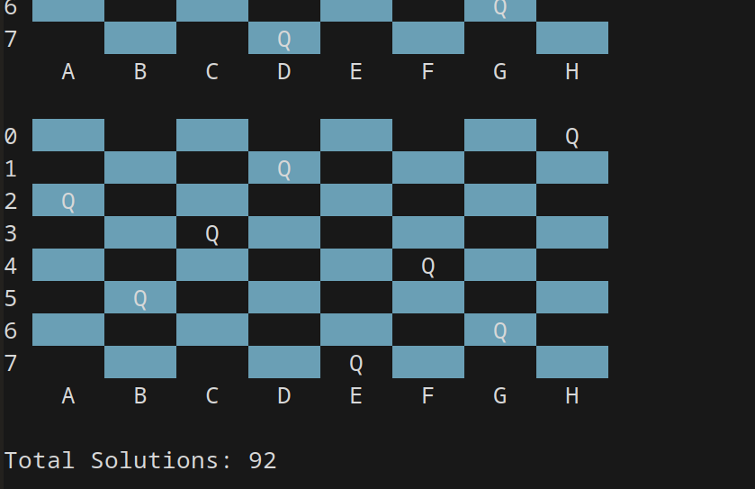

# ♔ Juego de las 8 Reinas

Este directorio contiene la solución al problema de las 8 reinas.



## 📝 Descripción
El objetivo del problema es colocar 8 reinas en un tablero de ajedrez de 8x8 de manera que ninguna de ellas se ataque entre sí. Esto significa que no pueden estar en la misma fila, columna ni diagonal.

## 🚀 Enfoque de la solución
- Utiliza **Backtracking** para explorar todas las posibles configuraciones válidas.
- Implementado en **C**.
- Encuentra las **92 soluciones únicas** del problema.

## 📂 Archivos
- `main.c` → Implementación del algoritmo.
  
## 🎯 Cómo ejecutarlo
Ejecuta el script con:
```bash
gcc main.c -o main
```
Esto imprimirá todas las soluciones encontradas en la terminal.

---

¡Intenta resolverlo antes de ver la solución! 🚀
