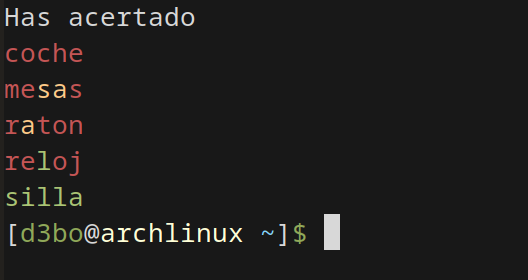

# 🟩 Wordle en Python

## 📖 Descripción
Este programa es una versión del popular juego Wordle, en el que el jugador debe adivinar una palabra oculta en un número limitado de intentos.



## 🛠️ Técnicas Utilizadas
- Manejo de cadenas y listas
- Estructuras de control
- Comparación de caracteres

## 🚀 Cómo Ejecutarlo
1. Ejecuta el script con:
   ```bash
   python3 main.py
   ```
---

¡Intenta resolverlo antes de ver la solución! 🚀

